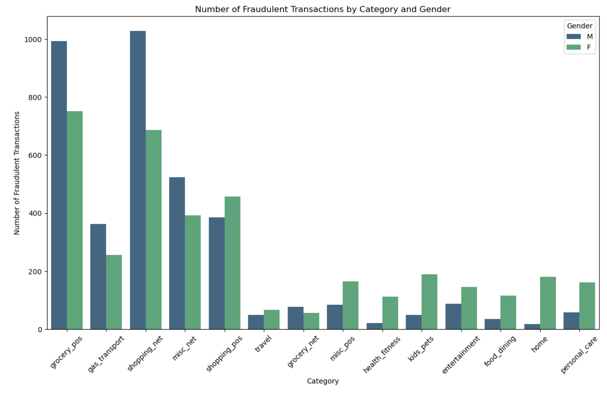

# Credit Card Fraud Detection

## Introduction
This project contains exploration of different models for predicting whether a credit card transaction is fraudulent or not

Followed the CRISP DM techniques and worked using the following models

* Logistic Regression
* KNN
* Decision Tree
* SVM

### Datasource

Dataset - https://www.kaggle.com/datasets/kartik2112/fraud-detectionLinks

This is a simulated credit card transaction dataset containing legitimate and fraud transactions from the duration 1st Jan 2019 - 31st Dec 2020. It covers credit cards of 1000 customers doing transactions with a pool of 800 merchants.

### Data Visualizations

### Feature importance

Dropped some of the less important fields and computed fields like age from dob and hour of the day from transaction time fields

### Models performance

### Next steps

Use ensemble techniques and evaluate other neural network models